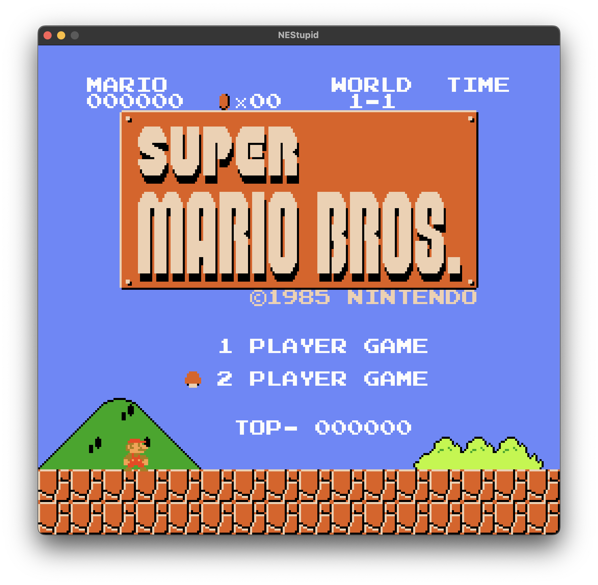

# NEStupid

**NEStupid** is a lightweight, cycle-stepped Nintendo Entertainment System (NES) emulator written in C. It relies on SDL2 for rendering and cross-platform compatibility, while leveraging native platform APIs (such as Cocoa on macOS) for an enhanced user experience.

This project aims to approximate the inner workings of the NES hardware, including the Ricoh 2A03 CPU (6502 variant) and the Ricoh 2C02 PPU (Picture Processing Unit), with a focus on running classic titles.

<div align="center">
  
</div>

## Features

*   **CPU**: Complete 6502 instruction set emulation (official opcodes).
*   **PPU**: Cycle-based rendering pipeline with background scrolling, nametable mirroring, and 8x8/8x16 sprite support.
*   **Memory**: Standard memory map implementation including internal RAM, PPU registers, and cartridge mapping (NROM, MMC1).
*   **Native GUI (macOS)**: 
    *   **Native Menus**: Fully integrated system menu for standard controls.
    *   **Open ROM Dialog**: Native file picker to load games easily.
    *   **Key Binding Window**: Dedicated native window to remap controller buttons to any keyboard key (including modifiers like Shift/Ctrl).
*   **Graphics**: SDL2-based framebuffer rendering.
*   **Input**: Remappable keyboard-mapped controller input.

## Prerequisites

To build NEStupid, you need:

*   **C Compiler** (GCC or Clang)
*   **CMake** (3.10+)
*   **SDL2 Development Libraries**

### macOS (Homebrew)
```bash
brew install cmake sdl2
```

### Ubuntu/Debian
```bash
sudo apt-get install build-essential cmake libsdl2-dev
```

## Building

Clone the repository and build using CMake:

```bash
mkdir build
cd build
cmake ..
make
```

This will generate the `NEStupid` executable (or `NEStupid.app` bundle on macOS).

## Usage

### GUI Mode
Simply run the application without arguments (or double-click the App Bundle):
```bash
./NEStupid.app/Contents/MacOS/NEStupid
```
-   Use **File -> Open ROM...** (Cmd+O) to load a game.
-   Use **NEStupid -> Key Bindings...** (Cmd+K) to configure controls.

### Command Line Mode
You can also launch a specific game directly:
```bash
./NEStupid.app/Contents/MacOS/NEStupid ../smb.nes
```

*Note: The emulator currently supports **NROM** (0) and **MMC1** (1) mapper games (e.g., Super Mario Bros, The Legend of Zelda). Advanced mappers (MMC3) are in development.*

## Controls

The emulator maps **Controller 1** to the keyboard. Default bindings are:

| NES Button | Default Key      |
|------------|-------------------|
| **A**      | `Z`               |
| **B**      | `X`               |
| **Start**  | `Enter` (Return)  |
| **Select** | `Shift`           |
| **D-Pad**  | `Arrow Keys`      |

**Note:** You can remap these keys at any time using the **Key Bindings** menu option.

## Development Status

- [x] **CPU**: Cycle-accurate instruction execution.
- [x] **PPU**: Background fetching, scrolling, and Sprite 0 Hit detection.
- [x] **Sprites**: Secondary OAM evaluation and 8-sprite limit enforcement.
- [ ] **APU**: Audio Processing Unit (Not yet implemented).
- [x] **Mappers**: NROM (0) and MMC1 (1) are functional. MMC3 support is planned.
- [x] **GUI**: Native macOS integration (Menu, Open ROM, Key Config).

## License

This project is licensed under the MIT License - see the [LICENSE](LICENSE) file for details.

*Note: This project is for educational purposes. All rights to the authentic NES hardware and games belong to Nintendo.*
